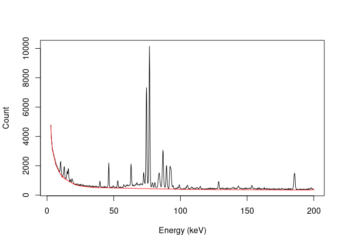
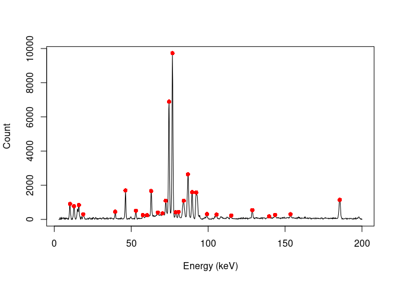
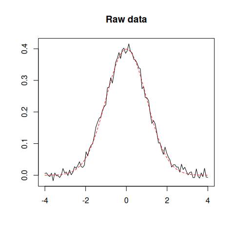
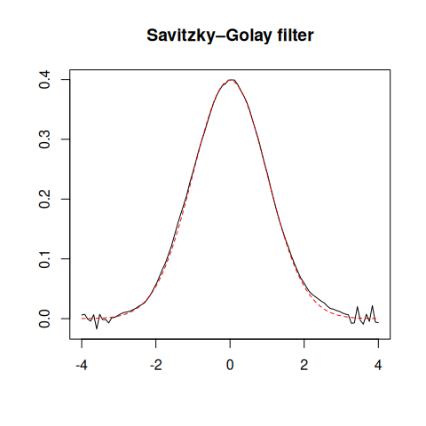

<!-- README.md is generated from README.Rmd. Please edit that file -->

# alkahest 

<!-- badges: start -->

[](https://github.com/tesselle/alkahest/actions)
[](https://app.codecov.io/gh/tesselle/alkahest)
[](https://www.codefactor.io/repository/github/tesselle/alkahest/overview/main)
[](https://cran.r-project.org/package=alkahest)

<a href="https://tesselle.r-universe.dev" class="pkgdown-devel"></a>

[](https://www.repostatus.org/#active)
<!-- badges: end -->

## Overview

**alkahest** is a lightweight, dependency-free toolbox for
pre-processing XY data from experimental methods (i.e. any signal that
can be measured along a continuous variable). It provides methods for
baseline estimation and correction, smoothing, normalization,
integration and peaks detection.

## Installation

You can install the released version of **alkahest** from
[CRAN](https://CRAN.R-project.org) with:

``` r
install.packages("alkahest")
```

And the development version from [GitHub](https://github.com/) with:

``` r
# install.packages("remotes")
remotes::install_github("tesselle/alkahest")
```

## Usage

``` r
## Load the package
library(alkahest)
```

**alkahest** expects the input data to be in the simplest form (a
two-column matrix or data frame, a two-element list or two numeric
vectors).

``` r
## X-ray diffraction
data("XRD")

## Whittaker smoothing
smooth <- smooth_whittaker(XRD, lambda = 1000, d = 2, sparse = TRUE)

## 4S Peak Filling baseline
baseline <- baseline_peakfilling(smooth, n = 10, m = 5, by = 10)

plot(XRD, type = "l", xlab = expression(2*theta), ylab = "Count")
lines(baseline, type = "l", col = "red")
```

<!-- -->

``` r
## Correct baseline
XRD <- signal_drift(XRD, lag = baseline, subtract = TRUE)

## Find peaks
peaks <- peaks_find(XRD, SNR = 3, m = 11)

plot(XRD, type = "l", xlab = expression(2*theta), ylab = "Count")
lines(peaks, type = "p", pch = 16, col = "red")
```

<!-- -->

``` r
## Simulate data
set.seed(12345)
x <- seq(-4, 4, length = 100)
y <- dnorm(x)
z <- y + rnorm(100, mean = 0, sd = 0.01) # Add some noise

## Plot raw data
plot(x, z, type = "l", xlab = "", ylab = "", main = "Raw data")
lines(x, y, type = "l", lty = 2, col = "red")

## Savitzky–Golay filter
smooth <- smooth_savitzky(x, z, m = 21, p = 2)
plot(smooth, type = "l", xlab = "", ylab = "", main = "Savitzky–Golay filter")
lines(x, y, type = "l", lty = 2, col = "red")
```



## Contributing

Please note that the **alkahest** project is released with a
[Contributor Code of Conduct](https://www.tesselle.org/conduct.html). By
contributing to this project, you agree to abide by its terms.
