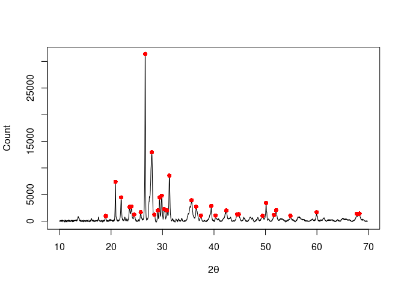

<!-- README.md is generated from README.Rmd. Please edit that file -->

# alkahest

<!-- badges: start -->

[](https://github.com/tesselle/alkahest/actions)
[](https://app.codecov.io/gh/tesselle/alkahest)
[](https://www.codefactor.io/repository/github/tesselle/alkahest/overview/main)
[](https://cran.r-project.org/package=alkahest)

<a href="https://tesselle.r-universe.dev" class="pkgdown-devel"></a>
<a href="https://cran.r-project.org/package=alkahest"
class="pkgdown-release"></a> <a
href="https://cran.r-project.org/web/checks/check_results_alkahest.html"
class="pkgdown-release"></a>
<a href="https://cran.r-project.org/package=alkahest"
class="pkgdown-release"></a>

[](https://www.repostatus.org/#wip)
<!-- badges: end -->

## Overview

**alkahest** is a lightweight, dependency-free toolbox for
pre-processing XY data from experimental methods (i.e. any signal that
can be measured along a continuous variable). It provides methods for
baseline estimation and correction, smoothing, normalization,
integration and peaks detection.

## Installation

You can install the released version of **alkahest** from
[CRAN](https://CRAN.R-project.org) with:

``` r
install.packages("alkahest")
```

And the development version from [GitHub](https://github.com/) with:

``` r
# install.packages("remotes")
remotes::install_github("tesselle/alkahest")
```

## Usage

``` r
## Load the package
library(alkahest)
```

**alkahest** expects the input data to be in the simplest form (a
two-column matrix or data frame, a two-element list or two numeric
vectors).

``` r
## gamma-ray spectrometry
data("BEGe")

## Subset from 3 to 200 keV
BEGe <- signal_select(BEGe, from = 3, to = 200)

## SNIP baseline
BEGe_snip <- baseline_snip(BEGe, LLS = FALSE, decreasing = FALSE, n = 100)

plot(BEGe, type = "l", xlab = "Energy (keV)", ylab = "Count")
lines(BEGe_snip, type = "l", col = "red")
```

<!-- -->

``` r
## X-ray diffraction
data("XRD")

## Correct baseline
XRD_correct <- signal_correct(XRD, method = "SNIP")

## Find peaks
XRD_peaks <- peaks_find(XRD_correct, SNR = 3, m = 5)

plot(XRD_correct, type = "l", xlab = expression(2*theta), ylab = "Count")
lines(XRD_peaks, type = "p", pch = 16, col = "red")
```

<!-- -->

``` r
set.seed(12345)
x <- seq(-4, 4, length = 100)
y <- dnorm(x) + rnorm(100, mean = 0, sd = 0.01)

## Plot raw data
plot(x, y, type = "l", xlab = "", ylab = "", main = "Raw data")

## Rectangular smoothing
unweighted <- smooth_rectangular(x, y, m = 3)
plot(unweighted, type = "l", xlab = "", ylab = "", main = "Rectangular smoothing") 

## Triangular smoothing
weighted <- smooth_triangular(x, y, m = 5)
plot(weighted, type = "l", xlab = "", ylab = "", main = "Triangular smoothing")

## Savitzky–Golay filter
savitzky <- smooth_savitzky(x, y, m = 21, p = 2)
plot(savitzky, type = "l", xlab = "", ylab = "", main = "Savitzky–Golay filter")
```


## Contributing

Please note that the **alkahest** project is released with a
[Contributor Code of Conduct](https://www.tesselle.org/conduct.html). By
contributing to this project, you agree to abide by its terms.
